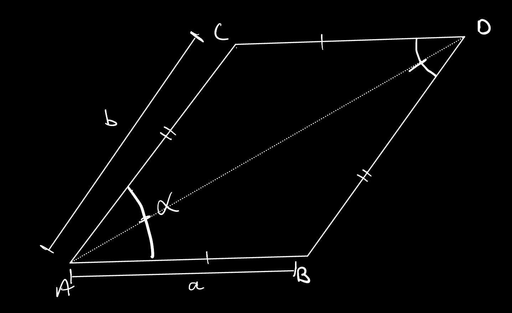
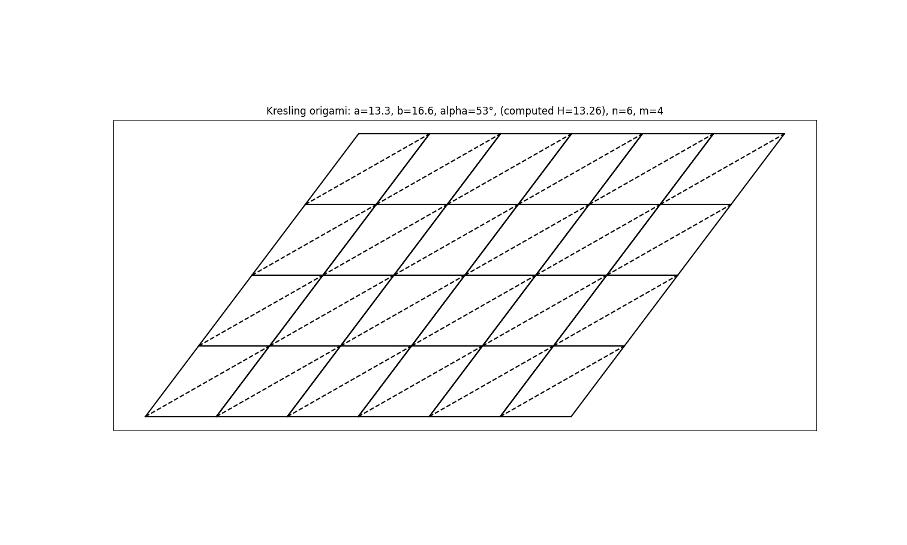

# Kresling Origami Pattern Generator

This project generates a **Kresling origami pattern** that can be printed and folded into a triangulated cylindrical structure. The script uses **Python, NumPy, and Matplotlib** to create a tiled net of parallelograms that form the Kresling pattern.

## Features
- Generates a **customizable Kresling origami pattern**.
- Allows **adjustment of key parameters**: side lengths, angles, and tiling.
- Outputs a **clean visual representation** for printing and folding.

## Understanding Parameters
- To create the Kresling structure with your desired parameters, use the following diagram for reference:  
  
- This should produce an output that looks like this:  
  

## Installation, Setup, and Running
1. Clone this repository:
   ```sh
- git clone https://github.com/elliot-karp/kresling-origami.git
- cd kresling-origami
2. Install dependencies:
- pip install matplotlib numpy
3. Run with default parameters, or modify the values in the main section of kresling.py
- python3 kresling.py

## Printing and Folding
1.	Save the output from Matplotlib, or take a screenshot.
2.	Print the sheet in any size you prefer.
3.	Fold along all of the lines.
4.	Roll it into a tube shape, and push in each parallelogram if needed.